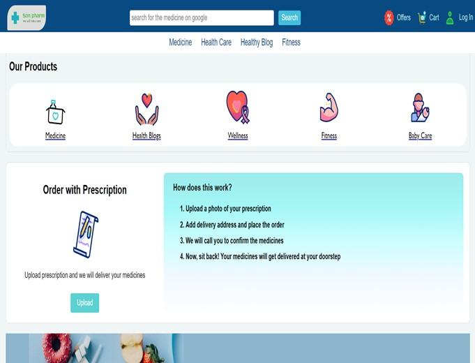
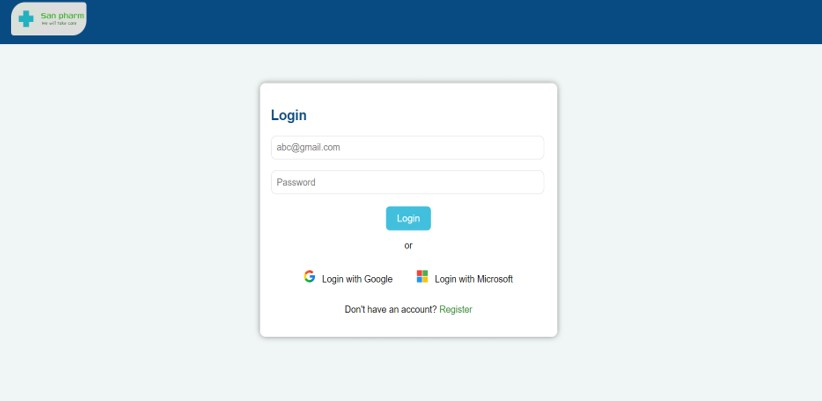
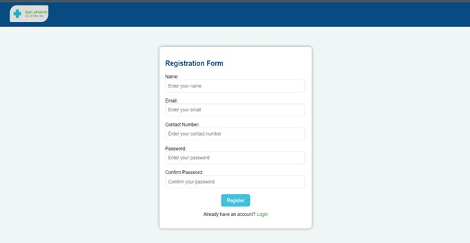
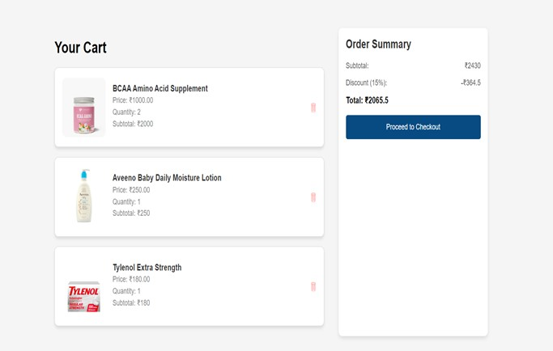
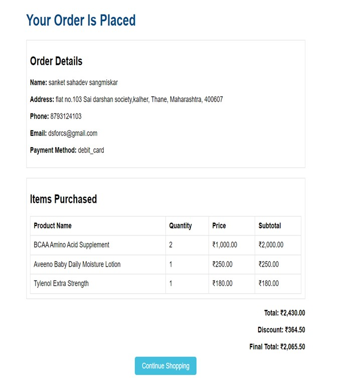
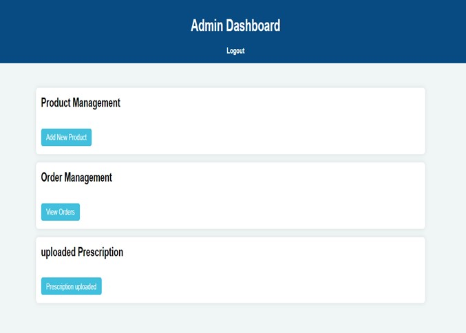
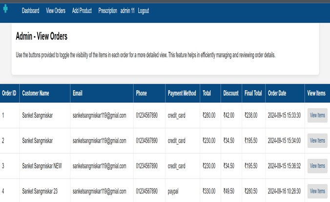
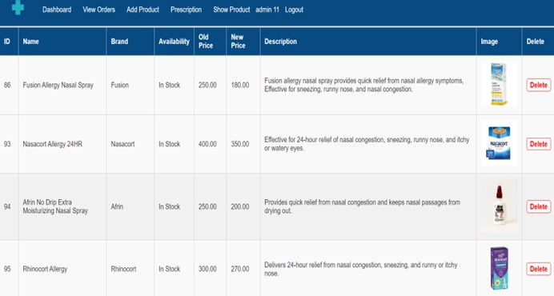

# 💊 San-Pharma

San-Pharma is a fully functional **online pharmacy store** developed using **HTML, PHP, and MySQL**. It allows users to browse medicines, manage their carts, place orders, and handle accounts with authentication. It also features an **Admin Dashboard** for managing products, customers, and orders.

## 🧠 Key Features

- 🧑‍💻 **User Authentication**: Secure login and sign-up system for customers.
- 🛒 **Product Browsing**: Search and view detailed descriptions of medicines.
- 🧺 **Cart Management**: Add, update, and remove products from the cart.
- ✅ **Order Confirmation**: Place orders with real-time updates.
- ⚙️ **Admin Panel**: 
  - Add/Edit/Delete Products
  - Manage Orders
  - View Registered Users
- 🔒 **Secure Sessions** for both users and admin.
- 📊 **Dashboard UI** for the admin with product and order summaries.

## 🧱 Tech Stack

- 🌐 **Frontend**: HTML, CSS, JavaScript
- 🧩 **Backend**: PHP
- 💾 **Database**: MySQL
- 🖥️ **Server**: Apache (XAMPP/WAMP recommended for local development)

## 🔐 Admin Login

Use the following credentials to log into the admin dashboard:

- **Username**: `admin11`  
- **Password**: `admin`

## 📸 Screenshots

> All Screenshots are placed in the `Screenshots/` folder inside the project directory.

| Description | Image |
|-------------|-------|
| 🏠 **Home Page** |   The homepage includes banners, categories, and featured medicines. Two views are shown for full layout. |
| 🔐 **Login Page** |  |
| 📝 **Signup Page** |  |
| 💊 **Product Page** |  |
| 🧺 **Cart Page** |  |
| 📦 **Order Page** |  |
| 🧠 **Health Blog** |  |
| 📊 **Admin Dashboard** |  |
| 📋 **Order Management** |  |
| 🧰 **Product Management** |  |
